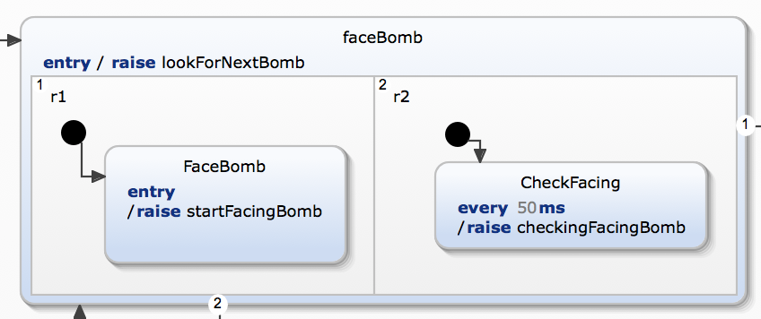
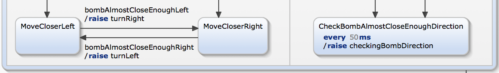

<center>
# Rapport du projet Robot
### Florian SALORD
</center>

## Comportement de la FSM

### Comportement global
Le comportement de la FSM peut être regroupé en 6 étapes :

1. Trouver et s'orienter face à une bombe.
- Se rapprocher de la bombe de manière grossière, puis de manière plus fine.
- Attraper la bombe.
- S'orienter vers une zone proche de la zone de dépôt des bombes et y aller.
- S'orienter vers la zone sécurisée et y rentrer.
- Déposer la bombe et ressortir de la zone.

Une vidéo de démonstration avec la scène fournie par défaut est disponible en cliquant sur [ce lien](https://unice-my.sharepoint.com/:v:/g/personal/florian_salord_etu_unice_fr/EV1CO8uSwx1LpgasgowlBE0BW6yNSn1EtdPnMgXp8K7hUA?e=ZRmdqJ).

### Détail du comportement
Certaines des étapes décrites précédemment nécessitent des vérifications régulières qui sont effectuées dans des états parallèles comme suit : 

<center>

</center>

Ces états parallèles permettent de changer d'état lorsque certaines conditions sont atteintes (ici lorsque le robot fait face à la bombe qu'il veut récupérer).

<div style="page-break-after: always;"></div>

Pour l'étape n°2, la FSM permet lorsque le robot est proche de la bombe de tourner du bon côté selon l'orientation du robot. S'il s'avère que le robot se trompe de côté, il peut inverser sa direction afin de ne pas faire un tour complet sur lui-même (voir schéma ci-dessous).

<center>

</center>

Cette action de tourner à gauche ou à droite est basée sur la position des bombes, ce qui pose parfois problème puisqu'il y a un décalage entre la position théorique de la bombe (x, y), et sa position réelle dans le simulateur. Pour pallier à ce problème et détecter la bombe correctement, le programme utilise le capteur en face du robot. Ainsi le changement d'orientation ne peut s'effectuer qu'une seule fois pour éviter que le robot alterne rapidement autour d'une position qui n'est pas réellement celle de la bombe.

Une fois face à la bombe et suffisamment proche d'elle, le robot l'attrape puis va la déposer en suivant les étapes n°4, 5 et 6.

### Gestion du temps réel
La gestion du temps est utilisée dans deux cas :

- Actions répétitives
	- Vérifications régulières d'orientation.
	- Vérifications régulières de distance.
- Actions uniques
	- Un temps de délai une fois la bombe détectée avec le capteur frontal afin de s'aligner un peu mieux face à la bombe.
	- Attraper la bombe (puisque l'action n'est pas instantanée pour le robot).
	- Relâcher la bombe (même justification que ci-dessus).
	- Sortir de la zone sécurisée en marche arrière.

<div style="page-break-after: always;"></div>

## Code

Au niveau du code en lui-même, chaque event est associé à du code soit directement soit via une méthode si la taille du code est trop importante.  
Cela permet d'avoir du code lisible et ordonné.

Le code du robot utilise l'interface de PolyRob pour intéragir avec le simulateur.

Contrairement à PolyBrain qui utilise une carte pour se repérer, mon robot (PolyDumb) ne se dirige qu'avec la position des bombes et son capteur frontal.

## Extensions

### Choix de la bombe
Il existe plusieurs méthodes pour choisir la bombe à récupérer :

1. Bombe la plus proche du robot.
- Bombe la plus proche du robot sur l'axe horizontal.
- Bombe la plus proche du robot sur l'axe vertical.
- Bombe la plus proche de la zone sécurisée.

Ces différentes méthodes sont accessibles en commentant / décommentant une partie du code dans la méthode checkEvents (voir l'extrait de code ci-dessous).

```java
fsm.getSCInterface().lookForNextBomb.subscribe(event -> {
            locateClosestBomb();
            // or use
            // locateClosestHorizontalBomb();
            // or use
            // locateClosestVerticalBomb();
            // or use
            // locateBombClosestToSafeZone();
        });
```

### Gestion des obstacles
Pas de gestion des obstacles.