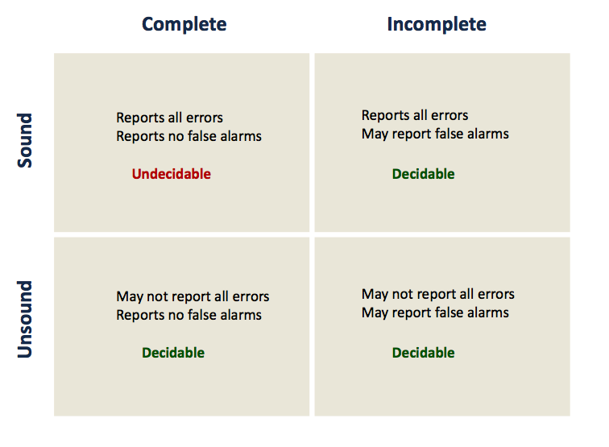

#SecuLog

##Encryption modes

### CBC

### CFB

### ECB

### OFB

Image encodée avec :  
- ECB : les formes sont visibles mais les couleurs sont cryptées  
- CBC : les pixels sont complètement brouillés

Texte corrompu décrypté avec 
- ECB : Le début du document est corrompu, la fin est correctement décryptée.  
- CBC : Une partie des caractères est correctement récupéré mais certains ont leur information changée et le début du fichier est complètement corrompu.  
- CFB : Le début du document est correct, la fin est corrompue.  
- OFB : Uniquement la zone modifiée est corrompue.  

Padding utilisé sur des blocs de taille fixe. Pour CBC et ECB, le texte est lu avant, donc il y a du padding, tandis que pour CFB et OFB, le texte est lu après l'encryptage, donc pas de padding.

##Hash

The key should be the same size as the hash output. if you are using SHA-256 so you should use a 256-bit key (which equals 32-bytes).
The HMAC algorithm is really quite flexible, so you could use a key of any size. However, if you only use a 128-bit key then there is no point using a 256-bit hash; you might as well use a 128-bit hash like MD5.

Calcule une empreinte servant à identifier rapidement, bien qu'incomplètement, la donnée initiale.

##Injection SQL

Building a SQL command string with user input in any language is dangerous. Ex :  

- admin' --
- ' or 1=1 --

###Contre-mesures

- Ineffective Mitigations
	- Blacklists
	- Stored Procedures
- Partially Effective Mitigations
	- Whitelists 
	- Prepared Queries

##Cross Site Scripting XSS

Steal valuable data by injecting scripting code, spoof requests, compromise system, web defacing.

Protection : 

- Validate all headers, cookies, query strings, form fields, and hidden fields (i.e., all parameters) against a rigorous specification of what should be allowed.  
- Do not attempt to identify active content and remove, filter, or sanitize it. There are too many types of active content and too many ways of encoding it to get around filters for such content.
- Adopt a 'positive' security policy that specifies what is allowed. ‘Negative’ or attack signature based policies are difficult to maintain and are likely to be incomplete.
- Input data validation and filtering

Avoid cookie theft by using httponly cookies

##Cross Site Request Forgery

###SOP : Same Origin Policy
Every frame in a browser is associated with a domain

- A domain is determined by the server, protocol, and port from which the frame content was downloaded
- If a frame explicitly includes external code, this code will execute within the frame domain even though it comes from another host

A script can only access resources (and notably cookies) associated with the same origin.  

- Prevents hostile script from tampering with other pages in the browser
- Prevents script from snooping on input (passwords) of other windows

###How?
CSRF exploits the trust that a site has in a user's browser.  
Bypass user control and browser SOP using tags and forms.  

Can attack home routers and change it's DNS settings.

###Defenses

- Secret Token Validation (hard-to-guess secret)
- Referer validation (can block requests if referer is missing but missingness can be exploited) - potential privacy problems
- Custom HTTP Header

##Race conditions

With parallel execution of tasks.  
Three properties are necessary for a race condition to exist: 

- Concurrency: There must be at least two control flows executing concurrently.
- Shared Object: A shared race object must be accessed by both of the concurrent flows.
- State Change: At least one of the control flows must alter the state of the object of a race

Race condition vulnerabilities typically arise when:

- Checking for a given privilege, and
- Exercising that privilege

Solution : Race conditions are eliminated by making conflicting operations mutually exclusive.

##TOC(T)TOU: Time-Of-Check-(To)-Time-Of-Use

- Check – Establish some precondition (invariant), e.g., access permission
- Use – Operate on the object assuming that the invariant is still valid

Can occur in any concurrent system:

- Shared memory (or address space)
- File system 
- Signals

##Memory corruption

###Buffer overflow

A buffer overflow occurs any time a program attempts to store data beyond the boundaries of a buffer, overwriting the adjacent memory locations.

- Stack
	- Local variables
	- Also used to store function environments and parameters during calls (stack frames)
	- LIFO
	- Multi-threading : multiple stacks
- Heap
	- Dynamically allocated variables
	- Reserved through calloc() and malloc()

###Stack overflow

Stack Overflows can be caused by:

- Recursive calls
- Reentrant interrupts
- Allocations on the stack
	- Large
	- Controlled by the attacker
	- Alloca(), char array[function_parameter]

Prevention not easy.

###Stack Buffer Overflow / Overrun
A special case of buffer overflow.  

Exploitation :

- Corrupting the Control Flow
- Corrupting the Program State (other stack frames)

###Heap buffer overflow

Detection is simple:

- Test if(hdr->prev->next==hdr) otherwise attack!
- Canaries
 - Objective : Detect unexpected modifications of values on the stack (e.g., return address).   
 Inserting a known value on the stack: the“canary”.
 - Limitations
		- Canaries can be guessed or obtained through memory leaks.
		- Canary copy needs to be stored in secure place that might also be corrupted.

###ASLR: Address Space Layout Randomization

Randomizes base addresses of memory segments so that they change at every load.

Limitations

- Memory leaks used to learn memory layout
- Address space / system limitations (e.g., page boundaries) may allow brute-force probes.

###Return-to-libc

Idea : Reuse existing code.

- "Fortunately" libc loaded at a constant address
- Divert control flow of exploited program into libc code
- "Load" parameters on the stack
- No code injection required: Jump to a known address

###Return-Oriented Programming (ROP)

Perception of return-into-libc: limited, easy to defeat, attacker cannot execute arbitrary code, relies on contents of libc.  
But false, Return-Oriented Programming is a special case of return-into-libc : arbitrary attacker computation and behavior (given any sufficiently large codebase to draw on).

- Exploits are not straight-line limited
- Showed to work on most architectures
- Equivalent to having a virtual machine/interpreter
- Can’t be defeated by removing functions like system()
- Must know the memory map (no ASLR)
- Need to find interesting gadgets and to chain them in a given order

Malicious code detection cannot be limited to executable memory regions

- Return oriented rootkits / malicious code...
- Even non executable memories needs to be verified

ROP defeated by ASLR: chaining returns needs to know addresses in advance

Blind ROP

- It is possible to learn where are the gadgets, brute
force and monitor side effects
- Stack learning overwrite a byte at a time and bruteforce it.

##Secure Software Development Life Cycle

- Security By Certification
	- Best Practices, Security Guidelines
	- Information Flow Control
- Security By Design
	- Security Objectives
	- Threat Analysis

	
###Security by certification

- PDG (Program Dependence Graph)
- JOANA IFC tool



###Security by design

- UML Proposals
	- SecureUML, Model-Driven Architecture [Basin et al.]
	- UMLsec [Juriens]
	- Abuse Cases [McDermott & Fox]
	- Misuse Cases [Sindre & Opdhal]

- Early Requirements Proposals
	- Anti-requirements [van Lamsweerde et al., Crook et al.],
	- Problem-Frames, Abuse Frames [Hall et al., Lin et al]
	- Security Patterns [Giorgini & Mouratidis]
	- Privacy Modelling [Liu et al., Anton et al,]

	
####SecureUML
Access control policy

Limit:

- NO analysis of security requirements within the organizational environment in which the software system will operate
- Need to know conflicting roles a priori
	- NO detection of conflicts from the requirements model of the system

	
####KAOS ~ CHAOS
Formalize goals into requirements.  
Identify goal violation scenarios.

Anti-goals :  
Intentional obstacles to security goals.  
Limits : boundaries unknown.

####Obstacle analysis
Take pessimistic view of goals.  
Identify as many ways of breaking goals as possible

####SysML-Sec : Y-chart revisited

- What: assets to be protected
- When: operation sequences in functions involving those assets
- Where: architecture mapping of functions involving those assets
- Why: attacks / threats envisioned that motivate security countermeasures
- Who: stakeholders + attackers & capabilities (risk analysis)
- How: security objectives due to architecture (e.g., network topology, process isolation, etc.)

####Abuse Cases
Specify an interaction between a system and one or more actors, where the results of the interaction are harmful to the system or one of the actors in the system

Limits : Model security requirements separately from functional requirements

- Abuse case diagrams show abuse only, not abuse together with normal use
- They do not investigate relations between use and abuse

####Misuse Cases
- Specify behaviour that the system should avoid
- Specify how a misuser can damage the system

Concepts :

- Misuser
	- Hostile actor
	- A similar notation as an actor in use cases, except the misuser has a black "head" instead of white
- Misuse case
	- Course of actions performed to do harm to a stakeholder or the system itself – behavior that is not wanted in the system
	- Illustrated by black circles

	
####Attack trees
Depict how a system element can be attacked : helps finding attack countermeasures.

SysML-Sec : went from attack trees to attack graphs

###Secure Architecture Principles
- Compartmentalization
	- Principle of least privilege 
	- Isolation
- Defense in depth
	- Use more than one security mechanism
	-  Secure the weakest link
	- Fail securely
- Keep it simple

####Principle of Least Privilege
A system module should only have the minimal privileges needed for its intended purposes.  
From monolithic design to component design.  
Android uses sandbox.

####Unix access control

Each file has owner and group.  
Only owner or root can change file permissions.  

Three setid bits :

- Setuid : set EUID of process to ID of file owner
	- “chmod u+s”  
- Setgid : set EGID of process to GID of file
	- “chmod g+s”
- Sticky
	- Off: if user has write permission on directory, can rename or
remove files, even if not owner
	- On: only file owner, directory owner, and root can rename or remove file in the directory
	-  ”chmod +t”

	
Setuid system call : seteuid(newid) can set EUID to

- Real ID or saved ID, regardless of current EUID
- Any ID, if EUID=0

If exec(), receives access to access owned by parent.

#####Summary
Advantages :

- Some protection from most users
- Flexible enough to make things possible

Main limitations :

- Too tempting to use root privileges
- No way to assume some root privileges without all root privileges

####Mandatory Access Control (MAC)
Access Control Models: Mandatory vs. Discretionary :  
Discretionary (DAC) = at the discretion of the resource owner.  
Enables the ability to deny users full control over the access to resources that they create.

####SELinux
Based on a strong, flexible mandatory access control architecture based on Type Enforcement, a mechanism first developed for the LOCK system.

####Weakness in isolation, privileges
- Network-facing Daemons
	- Root processes with network ports open to all remote parties,e.g., sshd, ftpd, sendmail, ...
- Rootkits
	- System extension via dynamically loaded kernel modules
- Environment Variables
	- System variables such as LIBPATH that are shared state across applications. An attacker can change LIBPATH to load an attacker-provided file as a dynamic library
- Shared Resources
	- Since any process can create files in/tmp directory, an untrusted process may create files that are used by arbitrary system processes
- Time-of-Check-to-Time-of-Use (TOCTOU)
	- Typically, a root process uses system call to determine if initiating user
has permission to a particular file, e.g. /tmp/X.
	- After access is authorized and before the file open, user may change the file /tmp/X to a symbolic link to a target file /etc/shadow.

###Secure Programming Platform

Java Authentication and Authorization Service (JAAS).  
Entreprise Java Beans (EJB).

###Defensive Programming
- Secure the weakest link
- Practice defense in depth
- Fail securely
- Follow the principle of least privilege – Compartmentalize
- Keep it simple
- Promote privacy
- Remember that hiding is hard
- Be reluctant to trust
- Use your community resources

How to check?

- Dynamic analysis
	- Run code, possibly under instrumented conditions, to see if there are likely problems
	- Need to choose sample test input
	- Can find bugs vulnerabilities
	- Cannot prove their absence
- Static analysis
	- Inspect code or run automated method to find errors or gain confidence about their absence
	- Consider all possible inputs (in summary form) 
	- Find bugs and vulnerabilities
	- Can prove absence of bugs, in some cases

	
#####Regression vs. Fuzzing
- Regression: Run program on many normal inputs, look for badness.
	- Prevent normal users from encountering errors (e.g. assertions bad).
- Fuzzing: Run program on many abnormal inputs, look for badness.
	- Prevent attackers from encountering exploitable errors (e.g. assertions often ok)

#####Fuzzing
- Mutation Based “Dumb Fuzzing”
	- Strengths
		-  Simple to setup and (rather) simple to automate
		-   Little to no “protocol” knowledge required
	- Weaknesses
		-  Limited by initial corpus
		-   May fail for protocols with checksums, those which depend on challenge response, etc.
- Generation Based “Smart Fuzzing”
	- Strengths
		- Completeness
		- Can deal with complex dependencies (e.g. checksums)
	- Weaknesses
		- Need specification of protocol (often can find good tools for existing protocols)
		- Writing generator can be labor intensive for complex protocols
		-  The specification is not the code (implementation may correspond to incomplete or wrongly interpreted specification)

####Sound and completness

